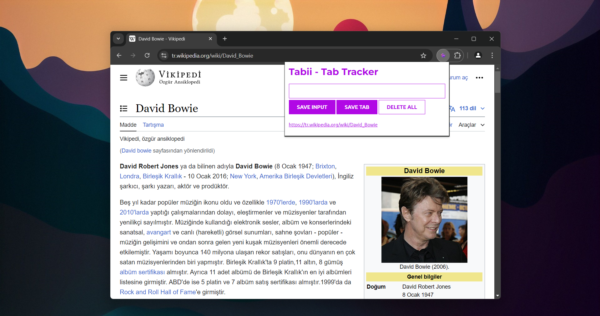
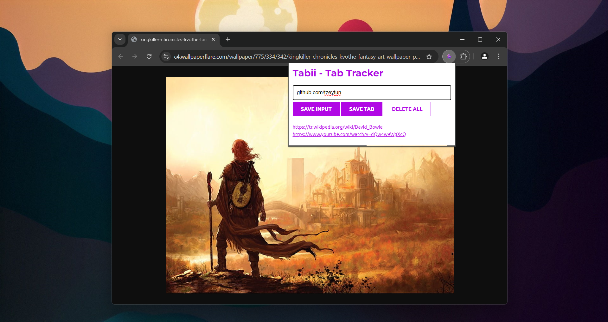
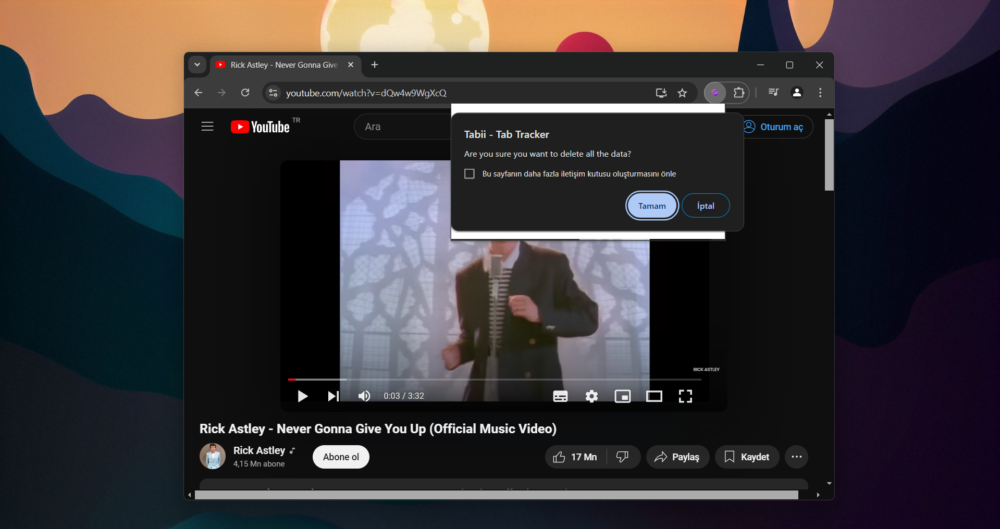

# TABİİ - Tab Tracker Chrome Extension

Tabii - Tab Tracker Chrome extension saves your currently open tab or manually entered website. The saved websites remain there until you delete them.  

## Screenshots

## Usage

SAVE INPUT : If you enter any website in the input field and click this button, it will save the entered website.

SAVE TAB : When you click this button, it saves the link of your current tab.

DELETE ALL : When you click this button, all saved websites will be cleared. A confirmation message will be requested before the sites are deleted.

## How to Install

Step 1: Clone the repository.
Step 2: Open Chrome.
Step 3: Go to [Extensions](chrome://extensions)
Step 4: Enable "Developer Mode" from the top right corner.
Step 5: Click the "Load unpacked" button.
Step 6: Select the cloned repository.
Step 7: When you click the puzzle icon in the top right corner of the Chrome browser, you can see our extension. That's it.

## Technologies Used

This project was built using the following technologies:

- HTML
- CSS
- JavaScript
- Chrome Extension API

## Acknowledgements

I learned how to make a Chrome Extension in JavaScript from [Scrimba](https://v2.scrimba.com/home) and received help from there.
